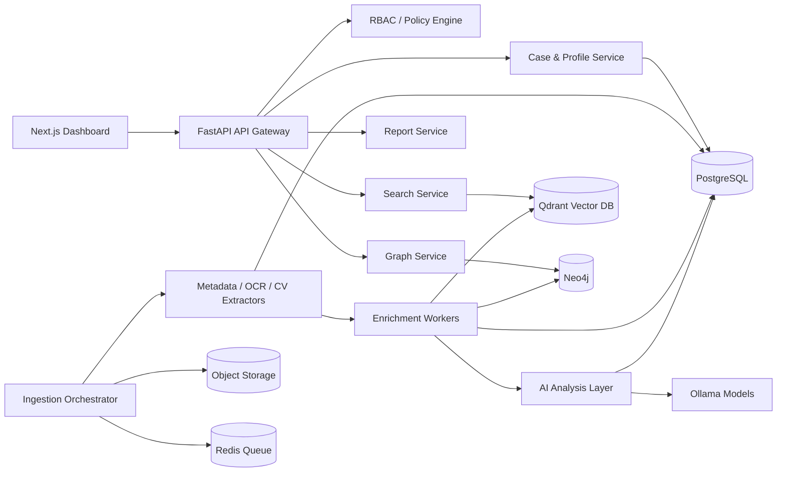

# Complete System Architecture

## Mission

KAAL-ASE is an AI-assisted OSINT and intelligence management system. It collects publicly available information, preserves source attribution, structures entities into profiles and cases, links entities in a knowledge graph, and supports analyst-led review through search, timelines, maps, and reports.

## Principles

- Public-source first: every fact must reference a public source, uploaded evidence item, or analyst note.
- Analyst controlled: AI can summarize, rank, cluster, and propose leads, but high-impact conclusions require human review.
- Audit everything: all reads, writes, exports, model outputs, and profile changes are logged.
- Confidence aware: every extracted claim carries source, extractor, timestamp, and confidence metadata.
- Modular by boundary: ingestion, extraction, enrichment, graph, AI analysis, search, and dashboard are independently deployable.

## Logical Components

## Module Breakdown

### 1. OSINT Engine

Responsibilities:

- File ingestion for images, documents, PDFs, videos, and audio.
- Metadata extraction with ExifTool, Tika/PDF parsers, ffprobe, OCR, and media fingerprinting.
- Public discovery via configured search/news/crawling connectors.
- Website crawling with robots.txt and rate-limit controls.
- Geolocation extraction from EXIF, text, landmarks, and analyst annotations.
- Entity extraction for people, organizations, locations, vehicles, events, documents, and social profiles.
- Profile candidate generation with explicit uncertainty and review status.

Default MVP limits:

- No private-account access.
- No credentialed scraping unless a source-specific legal review enables it.
- Face detection can locate faces for redaction or evidence indexing, but biometric identity matching is disabled by default.

### 2. Intelligence Database

PostgreSQL is the source of truth for cases, profiles, extracted facts, source references, timeline events, and audit logs. Object storage keeps original files and derived artifacts. Qdrant stores embeddings for semantic retrieval. Neo4j stores entity relationships optimized for link analysis.

### 3. Knowledge Graph Engine

Builds relationships between people, organizations, locations, events, documents, and social profiles. Graph edges retain provenance, confidence, first seen, last seen, and extraction method.

### 4. AI Analysis Layer

Uses local models through Ollama for:

- Intelligence summaries.
- Inconsistency detection.
- Lead generation.
- Risk triage.
- Pattern detection.
- Behavioral observation summaries.

AI outputs are stored as reviewable analysis artifacts, not ground truth.

### 5. Search & Retrieval

Supports:

- Natural language search over profiles, evidence, and analysis.
- Semantic search using embeddings.
- Entity search using PostgreSQL and Neo4j.
- Timeline search by event ranges.
- Geospatial search by location and radius.

### 6. Dashboard

Next.js dashboard views:

- Case management.
- Profile workspace.
- Evidence explorer.
- Live intelligence feed.
- Map view.
- Timeline view.
- Knowledge graph visualization.
- Report builder and export review.

## Runtime Flow

1. Analyst creates a case.
2. Analyst uploads public evidence or configures approved public-source connectors.
3. Ingestion stores raw artifacts in object storage and source records in PostgreSQL.
4. Extractors emit structured observations with confidence and provenance.
5. Entity resolver links observations to existing or candidate entities.
6. Graph builder writes nodes and edges to Neo4j.
7. Embedding worker writes searchable text chunks to Qdrant.
8. AI layer produces summaries and investigative leads.
9. Analyst reviews findings and promotes accepted facts to profile records.
10. Reports are generated with citations and audit records.

## Bounded Contexts

- Identity and Access: users, roles, permissions, policy checks.
- Case Management: cases, profiles, assignments, review status.
- Evidence Management: objects, checksums, metadata, source references.
- Extraction: raw observations from files and public web sources.
- Entity Resolution: candidate matching and analyst-confirmed merges.
- Graph Intelligence: relationship discovery and network analysis.
- AI Analysis: model runs, prompts, outputs, review decisions.
- Retrieval: text, vector, timeline, graph, and geospatial search.
- Audit and Compliance: immutable logs, export tracking, retention.

