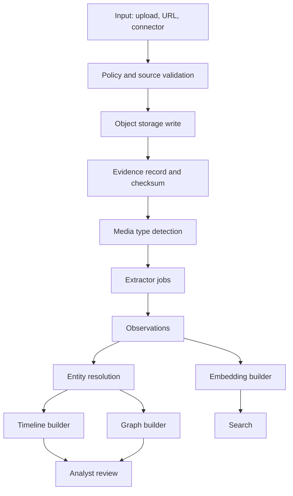

# Data Ingestion Pipeline

## Pipeline Stages



## Evidence Identity

Each evidence item receives:

- `evidence_id`
- SHA-256 hash
- storage URI
- source reference
- media type
- chain-of-custody metadata
- ingestion policy decision

## Extractor Outputs

Observations use a common envelope:

```json
{
  "observation_id": "",
  "case_id": "",
  "evidence_id": "",
  "type": "entity.person",
  "value": {},
  "confidence": 0.81,
  "source_reference_id": "",
  "extractor": "metadata-agent",
  "extractor_version": "0.1.0",
  "review_status": "candidate"
}
```

## Queue Design

Queues:

- `ingest.requested`
- `extract.metadata`
- `extract.ocr`
- `extract.vision`
- `extract.audio`
- `enrich.entity`
- `enrich.geo`
- `index.vector`
- `index.graph`
- `analysis.requested`
- `report.requested`

## Reprocessing

Reprocessing is triggered when:

- Extractor version changes.
- Analyst requests it.
- New model version is approved.
- Source is refreshed.

Old observations are not overwritten; they are superseded with links to replacement records.

